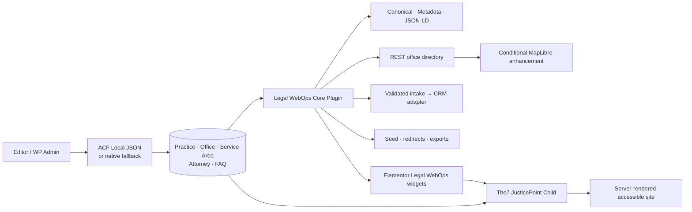

# JusticePoint Legal Platform

JusticePoint Legal Platform is a production-style WordPress portfolio demonstration for a fictional multi-location employment law firm. It solves a real publishing problem: one legal service may need a central practice guide, several office profiles, and dozens of useful local pages without copying layouts or letting SEO-critical data drift.

The public-facing firm, attorneys, addresses, telephone numbers, schools, content, and imagery are fictional. The site is not a law firm, does not offer legal advice, and is deliberately protected with `noindex,nofollow` in local/demo environments.

## The outcome

An editor creates a practice area, creates an office, then creates a service-area record by selecting those two sources and writing only local information. WordPress publishes a complete responsive page with its office contact, broader practice content, attorneys, FAQs, breadcrumbs, metadata, canonical, and schema. No layout rebuild is needed.

The implementation includes:

- a portable PSR-4 application plugin, `liston-legal-webops-core`;
- a presentation-only The7 child theme, `the7-justicepoint-child`;
- five custom post types and four taxonomies;
- ACF Pro Local JSON plus a secure native-field fallback;
- four original Elementor `Widget_Base` widgets in “Legal WebOps”;
- cached REST office filtering and a MapLibre/OpenStreetMap enhancement;
- original technical SEO and JSON-LD;
- CRM webhook, retry, validation, privacy, and analytics plumbing;
- a twenty-URL migration dataset and one-hop redirect manager;
- WP-CLI seed, validation, import, and server-config exports;
- PHPUnit, WPCS, ESLint, Stylelint, Prettier, Vite, and GitHub Actions;
- original AI-generated fictional imagery stored as optimized WebP assets.

## Why The7 and Elementor were retained

The brief represents an established commercial WordPress stack, not a greenfield theme exercise. Replacing The7 and Elementor would avoid the integration work the sample is meant to demonstrate. The7 remains the installed parent and Elementor Pro remains available to editors for Theme Builder and landing-page composition. The child theme owns the design language and template hierarchy without modifying The7.

Elementor is a presentation tool here, not the database. The dynamic service-area Theme Builder record delegates to a shared child-theme partial, and custom widgets query structured WordPress records server-side. Source data stays portable even if the builder changes.

## Why business logic lives in a plugin

Post types, relationships, redirects, REST routes, CRM behavior, schema, CLI commands, and validation must survive a theme change. The plugin owns that application layer. The child theme contains tokens, layouts, theme hooks, accessibility presentation, and frontend assets only.



More detail: [architecture.md](docs/architecture.md).

## Content architecture

| Source | Purpose | Primary relationships |
|---|---|---|
| `practice_area` | Firmwide legal-service knowledge | FAQs, attorneys, practice categories |
| `office` | Address, telephone, hours, market, geodata | Served practices, city, state |
| `service_area` | Curated practice + market landing page | Exactly one practice and one office; FAQs and attorneys |
| `attorney` | Fictional professional profile | Practices, offices, specialties |
| `faq` | Genuine visible question and answer | Practices and offices |

`DuplicateGuard` prevents two service-area records from using the same practice/office pair. ACF validates before save; the native fallback reverts accidental duplicates to draft and links to the existing record.

## Editor workflow

1. Publish a practice area and its reusable legal-service information.
2. Publish an office with address, contact, hours, coordinates, and served practices.
3. Add a Service Area and select the practice and office.
4. Write the unique local introduction, local considerations, nearby areas, FAQ/attorney relationships, and CRM campaign ID.
5. Publish. The shared template resolves all remaining content and context automatically.

The seed command demonstrates this at scale with 6 practices, 4 offices, 20 unique combinations, 4 fictional attorneys, 8 FAQs, and 5 pages.

## Custom Elementor addon

The plugin registers the `Legal WebOps` category and four original widgets:

- **Contextual Consultation CTA** detects the current practice and office, resolves the relevant telephone and consultation URL, and offers light/accent/compact editor variants.
- **Related Practice Areas** uses `WP_Query`, taxonomy context, current-post exclusion, and count/order/layout controls. Rendering is server-side.
- **Office Directory and Map** uses accessible GET controls, shareable filtered URLs, cached REST responses, an accessible server list, and a conditionally loaded MapLibre bundle.
- **Attorney Grid** resolves the current practice/office/service assignment without manual per-page selection and emits responsive WordPress images.

Widgets declare `get_style_depends()` and `get_script_depends()`. The ~285 KB gzip MapLibre bundle is absent from pages without the map. Importable references live in [elementor-templates](/wp-content/themes/the7-justicepoint-child/elementor-templates).

## Technical SEO decisions

- Server-rendered titles, descriptions, Open Graph, breadcrumbs, canonicals, robots, and JSON-LD.
- A consistent WordPress trailing-slash policy.
- Canonical overrides must use HTTP(S), match the site host, and contain no fragments.
- Page 2+ archives self-canonicalize to their exact page.
- Search, 404, and uncontrolled filter combinations are `noindex,follow` in production.
- Local/demo environments override that with `noindex,nofollow,noarchive` in both HTML and `X-Robots-Tag`.
- `FAQPage` is emitted only from published FAQs rendered visibly in the same template.
- `Organization`, `LegalService`, `Person`, `PostalAddress`, and `BreadcrumbList` use stable `@id` links.
- No rating, review, award, or legal-result schema exists.
- FAQ and Elementor template records are excluded from core sitemaps; an explicit `_jp_exclude_sitemap` or redirect-source match removes other entries.

If Yoast, Rank Math, AIOSEO, or The SEO Framework is detected, JusticePoint yields canonical, metadata, and schema output to that plugin to prevent duplicates. The local safety header remains. See [seo-decisions.md](docs/seo-decisions.md).

## URL migration demonstration

The 20-row [redirects.csv](redirects.csv) distributes legacy services across three patterns:

- `/services/{service}.html`
- `/practice-areas/{service}/`
- `/{city}/{service}/`

Commands:

```bash
wp liston-webops redirects validate redirects.csv
wp liston-webops redirects import redirects.csv --dry-run
wp liston-webops redirects import redirects.csv
wp liston-webops redirects export-nginx redirects.csv
wp liston-webops redirects export-apache redirects.csv
```

Validation detects duplicate sources, shared destinations requiring review, arbitrary loops, chains, missing destinations, malformed URLs, HTTP/HTTPS inconsistencies, `.html`/slash conflicts, unsafe homepage consolidation, and non-200 destinations. Imported paths are normalized for both root and subdirectory WordPress installations. The tested sample resolves in exactly one 301 to a 200 destination.

Full process: [migration-plan.md](docs/migration-plan.md).

## CRM and analytics architecture

The consultation form has browser and server validation, a purpose-specific nonce, sanitization, escaping, a honeypot, per-IP HMAC-keyed rate limiting, UTM/landing/referrer/click-ID capture, accessible field errors, and explicit consent.

`JP_CRM_WEBHOOK_URL` and `JP_CRM_WEBHOOK_TOKEN` are read from the environment. The adapter uses safe HTTP, no redirects, a request ID, bounded timeouts, and three retry attempts for transport/429/5xx failure. Logs contain only component, request ID, status, and a generic message—never contact details or form content. With no endpoint configured, a mock adapter confirms the demo without persisting the payload.

Only after confirmed delivery, JavaScript pushes:

```js
{ event: 'justicepoint_form_success', form_id: 'consultation', delivery_mode: 'mock_crm' }
```

No name, email, telephone, message, referrer, click ID, or other PII is sent to analytics.

## REST API

`GET /wp-json/liston-webops/v1/offices` accepts only `page`, `per_page` (1–50), `city`, `state`, and `practice_area`. Slugs are validated, filtering uses controlled taxonomy queries, IDs are primed in one metadata/term cache pass, responses are cached for five minutes, and total/page headers are predictable. There is no caller-supplied meta query.

## Performance and accessibility

- Custom map code is conditional; consultation code loads only when its form renders.
- The global theme script is ~1.2 KB before gzip.
- The7 FSE/post-type presentation assets are safely dequeued because custom templates do not use them.
- Original PNG generation masters were converted to 41–90 KB WebP files; WordPress generates responsive attorney sizes.
- The hero alone is preloaded and uses `fetchpriority="high"`; below-fold portraits lazy-load with dimensions.
- System font stacks avoid third-party font requests.
- Meaningful directory content and filters render before JavaScript.
- Navigation, forms, filters, map controls, FAQs, and focus states are keyboard operable.
- The site includes a single skip link, landmarks, heading hierarchy, visible errors, high-contrast focus, reduced motion, descriptive profile alt text, decorative-image empty alt text, and a list equivalent for every map location.

Measured results and methodology are recorded in [performance.md](docs/performance.md); targets are goals, not claims detached from a recorded environment.

## Local setup

### Existing MAMP installation

Requirements: WordPress, PHP 8.2+, The7 15+, The7 Core, Elementor, Elementor Pro, and optionally licensed ACF Pro.

```bash
git clone https://github.com/listoncosmas/justicepoint-legal-platform.git
cd justicepoint-legal-platform
cp .env.example .env
npm run setup
```

`tools/setup.sh` detects this project’s MAMP PHP/WP-CLI layout when available, otherwise it uses `wp` from `PATH`. It installs Composer/npm dependencies, builds both bundles, activates the plugin/child theme, and runs the idempotent seed.

For this MAMP site, WP-CLI is intentionally executed with its matching PHP/socket:

```bash
/Applications/MAMP/bin/php/php8.2.0/bin/php /Applications/MAMP/Library/bin/wp liston-webops seed
```

### wp-env

After placing licensed The7 at `wp-content/themes/dt-the7` and licensed Elementor Pro/ACF Pro as needed:

```bash
npm run env:start
```

`.wp-env.json` pins PHP 8.2, mounts the application plugin and child theme, maps the local The7 parent, and enables debug logging. Commercial packages are deliberately not distributable by this repository.

## Development commands

```bash
composer install --working-dir=wp-content/plugins/liston-legal-webops-core
npm install --prefix wp-content/plugins/liston-legal-webops-core
npm install --prefix wp-content/themes/the7-justicepoint-child
npm run build
npm run lint
npm run format:check
composer lint --working-dir=wp-content/plugins/liston-legal-webops-core
composer test --working-dir=wp-content/plugins/liston-legal-webops-core
wp liston-webops seed
wp liston-webops redirects validate tests/fixtures/redirects.csv
```

The local completed run passed 12 PHPUnit tests / 45 assertions, WPCS, ESLint, Stylelint, Prettier, ACF JSON validation, both Vite production builds, all redirect commands, REST validation, live redirect one-hop verification, and browser desktop/mobile checks.

## Repository map

```text
wp-content/
  plugins/liston-legal-webops-core/
    src/{Content,Elementor,SEO,Migration,REST,Integrations,CLI}/
    assets/  acf-json/  tests/  composer.json  package.json
  themes/the7-justicepoint-child/
    assets/  inc/  template-parts/  elementor-templates/
docs/
  architecture.md  migration-plan.md  seo-decisions.md
  performance.md  walkthrough.md  hiring-manager-summary.md  screenshots/
.github/workflows/ci.yml
```

## Security decisions

- Nonces and capability checks on administrative/form mutation.
- Typed sanitization for registered meta and REST fields.
- Escaping at output boundaries; safe HTML allow-lists for authored rich text.
- Prepared database identifiers/values and a unique redirect source index.
- Safe webhook URLs, secrets only from environment, no redirect following, bounded timeout/retry.
- Structured error responses without leaking webhook responses or credentials.
- Public directory routes are read-only; redirect admin UI is capability-protected and read-only.
- The demo stores no mock intake PII and emits no analytics PII.

## Commercial dependencies and honest boundaries

The7, Elementor Pro, and ACF Pro are commercial and absent from Git. This local installation has The7 and Elementor Pro; ACF Pro was not present, so the included native fallback keeps the site editable and functional while Local JSON remains ready for licensed production use.

A real launch would still require access to production hosting/CDN, DNS/TLS, object/page cache, Search Console, analytics/GTM, consent requirements, the CRM contract and field mapping, email/SMS providers, legal-content review, privacy counsel, monitoring/error aggregation, backup/restore procedures, traffic history, backlinks, indexed URL inventory, and representative production data. The recorded Lighthouse results apply only to the disclosed local test environment; no production score, ranking, conversion, testimonial, review, rating, or case outcome is claimed.

## Portfolio handoff

- [Three-minute walkthrough](docs/walkthrough.md)
- [Concise hiring-manager summary](docs/hiring-manager-summary.md)
- [Architecture](docs/architecture.md)
- [Performance methodology](docs/performance.md)
- [Desktop and mobile screenshots](docs/screenshots)

License: GPL-2.0-or-later for original code. Generated fictional images are project demonstration assets; do not treat them as real people or real attorney advertising.
