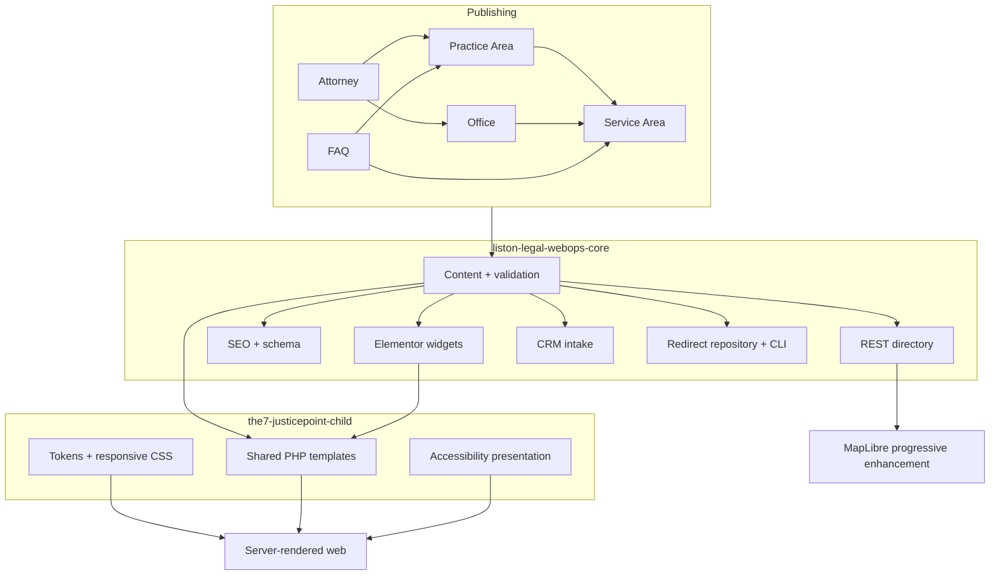

# Architecture

## Boundaries

The plugin is the portable application. The child theme is the replaceable presentation. Elementor is an editorial composition surface. ACF is a field UI, not the only storage contract. WordPress post/meta/taxonomy APIs are the persistence boundary.

## Request paths

### Service-area page

1. WordPress resolves `service_area`.
2. The Elementor Theme Builder condition or child single template calls one shared theme partial.
3. The partial loads the selected `practice_area` and `office` IDs.
4. Metadata is primed and reusable content is read from those sources.
5. Local introduction/considerations, campaign ID, nearby areas, assigned attorneys, and FAQs come from the service record.
6. SEO runs independently in `wp_head`, using the same graph to build canonical, Open Graph, LegalService, PostalAddress, FAQPage, and breadcrumbs.

### Office directory

1. GET filters render and execute on the server without JavaScript.
2. Controlled taxonomy clauses query offices; callers cannot provide meta queries.
3. REST enhancement calls `/liston-webops/v1/offices` with the same allow-list.
4. Results are cached for five minutes and returned with total-page headers.
5. JavaScript replaces the list with DOM nodes using `textContent`, updates the shareable URL, and syncs MapLibre markers.
6. The server list remains the accessibility and no-JavaScript fallback.

### Consultation intake

1. Browser constraint validation provides immediate feedback.
2. REST verifies a purpose-specific nonce, honeypot, HMAC-keyed rate limit, and field rules.
3. Sanitized CRM payload includes attribution fields but logs never include PII.
4. Adapter uses environment-only endpoint/token, a request ID, timeout, no redirects, and bounded retries.
5. Confirmed 2xx (or the non-persisting mock) returns success.
6. Only then does the browser emit a PII-free `dataLayer` event.

## Persistence

All relationships use stable post IDs. Taxonomies handle public grouping/filtering; controlled post meta holds structured source fields. The redirect table uses a unique normalized source path and prepared identifiers/values. No layout data is duplicated onto service records.

## Extension points

- `acf/settings/load_json` and `acf/settings/save_json` keep groups version-controlled.
- Elementor widgets declare their own dependencies.
- `wp_sitemaps_post_types` and `wp_sitemaps_posts_entry` enforce intentional sitemap output.
- `JP_CRM_WEBHOOK_URL` and `JP_CRM_WEBHOOK_TOKEN` swap mock delivery for a production adapter without code edits.
- CLI commands provide deterministic seed and migration operations.

